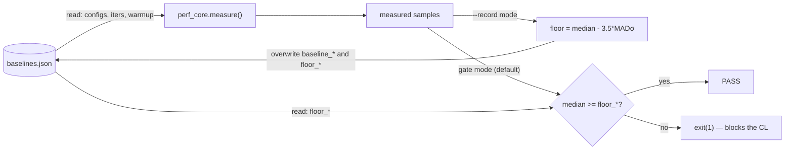

# H2D/D2H Single-Host Test

A presubmit gate that guards the **bandwidth** of the host↔device (D2H / H2D)
transfer path on a single machine — the PCIe/DMA copies between TPU HBM and host
pinned DRAM that Raiden uses to persist and restore the KV cache.

## Purpose

On a single host, D2H/H2D copies really do traverse the PCIe/DMA link between TPU
HBM and host pinned DRAM, so the measured throughput is a **meaningful hardware
bandwidth number**. This gate blocks a PR that regresses it.

> **This gate is a perf gate**, backed by recorded per-config floors. A separate
> **correctness** check (a d2h→h2d round-trip byte-equality assertion) runs first
> inside `perf_core.measure()` and is **never bypassable** — only the perf floor
> can be waived.

## Setup



The gate binary (`h2d_d2h_benchmark_gating.py`) measures, via `perf_core`, the
aggregate d2h and h2d bandwidth over the node's 8 chips.

| Aspect | Setting |
|---|---|
| Path | HBM ↔ host pinned DRAM over PCIe/DMA (`KVCacheManager.d2h()` / `.h2d()`) |
| Placement | each shard's host buffer in pinned memory NUMA-local to its device, so a copy is not silently taxed by a cross-socket hop |
| Sharding | 1 shard axis across all 8 chips |
| Metric | median of `iters = 20` timed runs (after `warmup = 3`), per direction |
| Correctness | one d2h→h2d round-trip byte-equality check before timing |

## Config choices

Two configs, both `[8, 128, 1024, 128]`, 1 layer — **large ~8 MB-per-chip
contiguous blocks that saturate the PCIe/DMA roofline** (v5e peak ≈ 920 Gbps d2h
/ 880 Gbps h2d).

| dtype | block / chip | measured d2h | why |
|---|---|---|---|
| int32   | 8 MB | ~835 Gbps | saturated bandwidth sentinel; int32 also enables byte-exact integrity |
| float32 | 8 MB | ~849 Gbps | saturated; a float dtype, closer to production than int32 |

**Why *saturated* configs, and why only two.**

- This presubmit gate compares a fresh median against a **static floor**
  (`median − 3.5·MADσ`), so it needs configs whose **run-to-run drift is much
  smaller than that few-sigma margin** — otherwise an innocent PR fails on a
  slightly slow sample, i.e. a flaky gate, which is unacceptable in presubmit.
- Measured over 200 iterations across two independent runs: the **saturated**
  configs are pinned against the hardware ceiling and barely move (CV ~1%,
  run-to-run drift **< 1%**) → a static floor sits just below the normal spread
  and rarely false-fails. Small, **overhead-bound** configs (the sensitive
  "canary" shapes) drift **~3%** run-to-run, comparable to their own spread → a
  static floor on them would be flaky.

So presubmit gates the stable saturated configs. The sensitive overhead-bound
canaries are measured with **same-machine A/B in post-submit** (the PR and its
base back-to-back on one machine, so the drift cancels), which is where per-op
software regressions are caught. fp8/bf16 drift even more and are trend-monitored
only.

## Verdict

For each config and direction: correctness round-trip must pass, then
`median >= floor`, where `floor = baseline_median − 3.5·MADσ` — an
outlier-resistant lower bound of the config's own run-to-run spread
(`MADσ = 1.4826 · median(|x − median|)`). Floors live in
`h2d_d2h_gating_baselines.json`, recorded once (large `--iters` for a stable MAD)
by `h2d_d2h_record_baselines.sh`; they can be refreshed periodically via the
record workflow.

A perf-floor failure blocks the PR, unless the author adds `[skip-perf-gate]`
(or `[skip-h2d-d2h-gating]`) to the CL description, or a maintainer sets
`"enforce": false` in the baselines file. Correctness failures are never waived.

## Running it

```bash
# Full gate across both JAX and PyTorch (default):
bazel run -c opt --config=oss --config=ci \
  //tpu_sync/benchmarks:h2d_d2h_benchmark_gating

# Select a single framework:
bazel run -c opt --config=oss --config=ci \
  //tpu_sync/benchmarks:h2d_d2h_benchmark_gating -- --framework=torch # or --framework=jax
```

In CI it runs as the unified `h2d_d2h_gating` workload in `benchmark_registry.pbtxt`
via the `run_benchmarks` workflow (on pull requests), evaluating both frameworks
on the assigned Cloud TPU runner. Re-record baselines for all frameworks with
the `--record` flag (or the `h2d_d2h_record` workflow).

## Scope

- **Catches:** regressions in the raw bandwidth path — lost DMA parallelism,
  broken host-buffer pinning, NUMA misplacement, dropping to a slower copy path.
  A saturated config sees these immediately.
- **Not covered here:** per-operation *software* overhead regressions (extra
  per-block work, queueing, sync) are hidden under the bandwidth ceiling, so a
  saturated config barely moves. These are covered by the overhead-bound canary
  under **same-machine A/B in post-submit**, not by this presubmit gate.